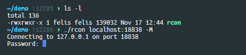
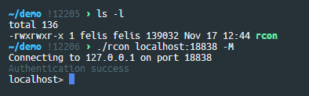
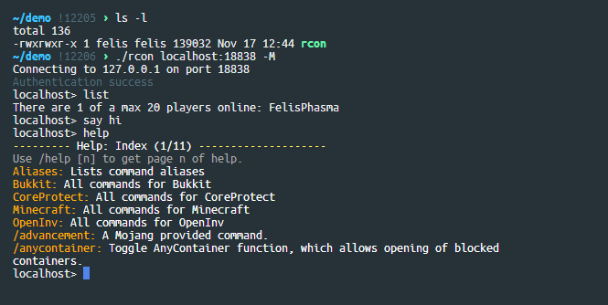
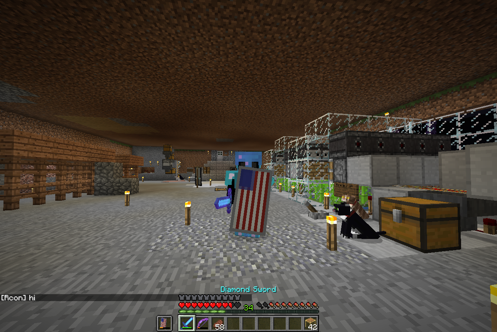
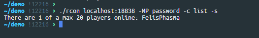
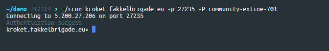
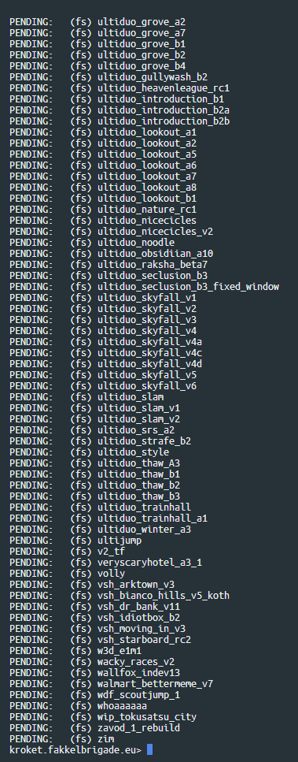

# Rcon

A simple and lightweight rcon client. Rcon is cross platform and has been
tested on windows 10 and linux.

# Install

## Windows

Download the latest [bundle](bundle.zip). Unzip the bundle and you will find `rcon.exe`. To run just
open a command prompt and navigate to the folder where rcon.exe is, then run `rcon` in command
prompt.

## Linux

Before you can download and build rcon you'll need to have git and g++ installed.

```bash
# This is for ubuntu. Do something simar for your system.
sudo apt update
sudo apt install git g++ dos2unix
```

Download and build rcon:

```bash
git clone https://github.com/jeremy-rifkin/rcon.git
cd rcon
dos2unix build.sh && chmod +x build.sh # because I'm a scrub who develops on windows...
./build.sh
```

The rcon executable can be found at `build/rcon`.

# Usage:

```
Usage:
	rcon <host> [options]
Parameters:
	<host> can be an ip or domain name and can include a port.
Options:
    -h --help     Display help message
    -p <port>     RCON Port. Overrides port specified along with host, if present.
    -P <password> RCON Password. If not present the user will be prompted for a password.
    -c <command>  Command to execute. If present, the program will simply run the command and exit.
    -s            Silent mode: suppress everything except command response. Only matters if -c is present.
    -M            Support Minecraft text formatting codes.
```

## Examples:

```
rcon 10.0.0.2 -p 25575 -P password -M
```
Connects to `10.0.0.2` on port `25575` using password `password`, and supports Minecraft text
formatting codes.

```
rcon 10.0.0.2 -pPM 25575 password
```
Rcon supports option collapsing. This command is the same as the above command. Connects to
`10.0.0.2` on port `25575` using password `password`, and supports Minecraft text formatting codes.

```
rcon 10.0.0.2:25575 -csM command
```
Connects to `10.0.0.2` on port `25575`, runs a command, handles Minecraft formatting codes, and
silences all output except for the command response. Since no password was specified, the user will
still be prompted for a password.


# Screenshots
















# License

Copyright (c) 2019 Jeremy Rifkin under the MIT license.
